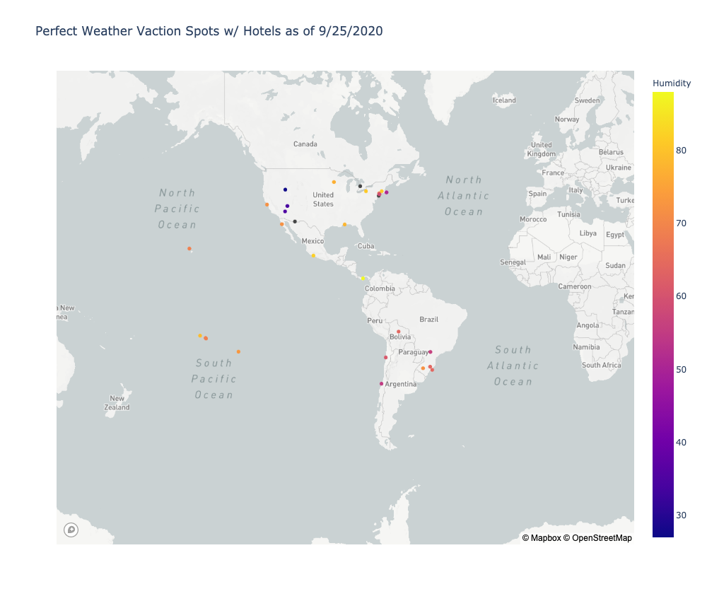

### Below is a list of the parameters I used to create this map of vacation spots.

#### 60 degrees F <= Max Temperature <= 80 degrees F

#### Wind Speed <= 20 MPHS

#### Cloud Cover <= 30%

Additionally I added another parameter outside of weather conditions. I have a really bad back, and I cannot endure super long flights. So restricted my destinations to the Western Hemisphere. I included the Hawaiian Islands, but in reality, I probably wouldn't choose to go there because that flight is too long as well.
