#### Scatter plot to showcase the relationship between Temperature (F) and a city's latitude.

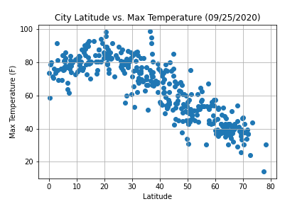

Here we are examining the relationship between a city's latitude and it's maximum temperature. As you can see, as a city's latitude has a clear relationship to it's max temperature as we would expect. Temperatures appear to be higher the closer they are to the equator, (0) degrees latitude.

#### Scatter Plot to showcase the relationship between Humidity and Latitude 

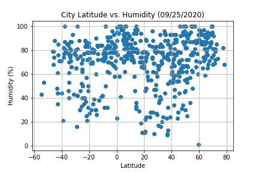

This scatter plot is displaying the relationship between a city's latitude and it's humidity levels. There does not appear to be a clear relationship between cities with higher humidities and their latitude based on the plot. However, there does appear to be a slight indication that many cities that lie between around -40 degrees and 40 degrees latitude have lower humidity levels.

### Scatter Plot to showcase the relationship between Cloudiness and Latitude 

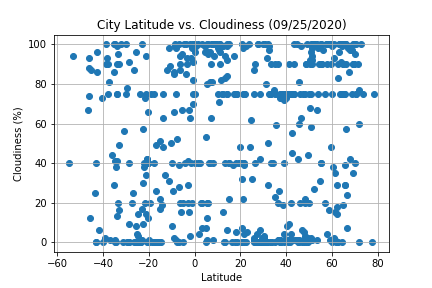

This scatter plot showcases the relationship between a cities latitude and its cloud cover. Latitude does not appear to be a major impactor of a city's cloud cover. Cities with high, medium and low cloud cover appear to be evenly distributed across all latitudes.

### Scatter Plot to showcase the relationship between Wind Speed and Latitude 

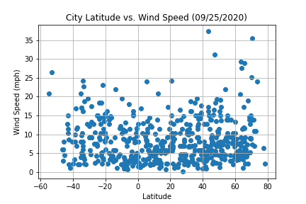

With this plot, we can see that there is perhaps a small relationship between a city's latitude and it wind speed. Although wind speed does appear to be rather equally distibuted, we do see that cities further away from the equator have the potential for higher wind speeds, especially in the Northern hemisphere.

## Linear Regression

### Temperature (F) vs. Latitude (Northern and Southern Hemisphere)

#### (Northern Hemisphere)
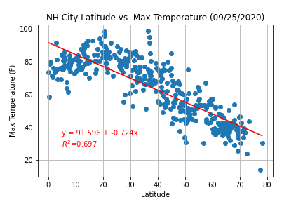

#### (Southern Hemisphere)
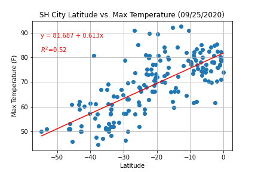

As you can see, the r squared value for this regression anaylis is quite high. This indicates that there is a strong correlation between latitude and the maximum temperatures in both the Northern and Southern Hemispheres. This is easily seen on the plot displayed above. The further you get away from the equator (0), the lower the max temperature.

### Humidity (%) vs. Latitude (Northern and Southern Hemisphere)¶

#### (Northern Hemisphere)
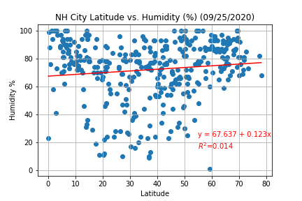

#### (Southern Hemisphere)
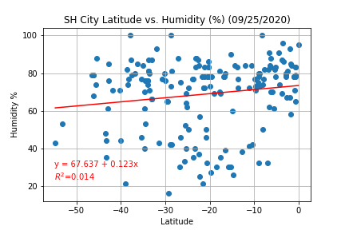

The r squared value for this linear regression is quite low suggesting that there is little correlation between latitude and humidity levels. However, as I mentioned above, one can still see there is still something going on here. Although humidity levels due appear to be dispearsed throughout, you can still see that most of the lower humidity levels are grouped together between about -30 and 40 degrees latitude. This consistent with the location of many of the world's deserts.

### Cloudiness (%) vs. Latitude (Northern and Southern Hemisphere)¶

#### (Northern Hemisphere)
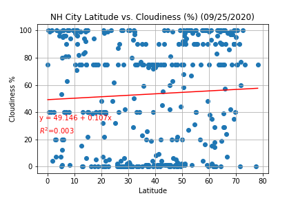

#### (Southern Hemisphere)
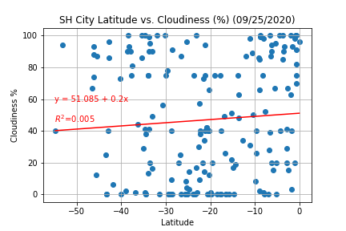

The R squared value for this linear regression is the lowest we've seen so far. There is apparently little to no correlation between cloudiness and latitude in either the Northern Hemisphere or Southern Hemisphere.

### Wind Speed (mph) vs. Latitude (Northern and Southern Hemisphere)¶

#### (Northern Hemisphere)
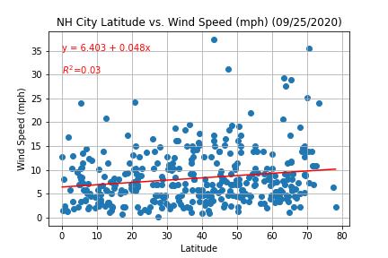

#### (Southern Hemisphere)
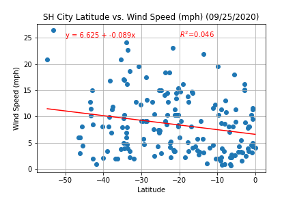

The data points here are quite spread out, and the R Squared value is low. This indicates that there is little to know correlation between latitude and wind speed. However, much like humidity, there are some data points that are of interest. You can see that there several cities located far to the north and south that report far higher wind speeds than others in this group. Although the R squared value is low, this data does suggest that cities further away from the equator are likely to experience windier conditions. According to the plots above, this is especially true in the Northern Hemisphere.